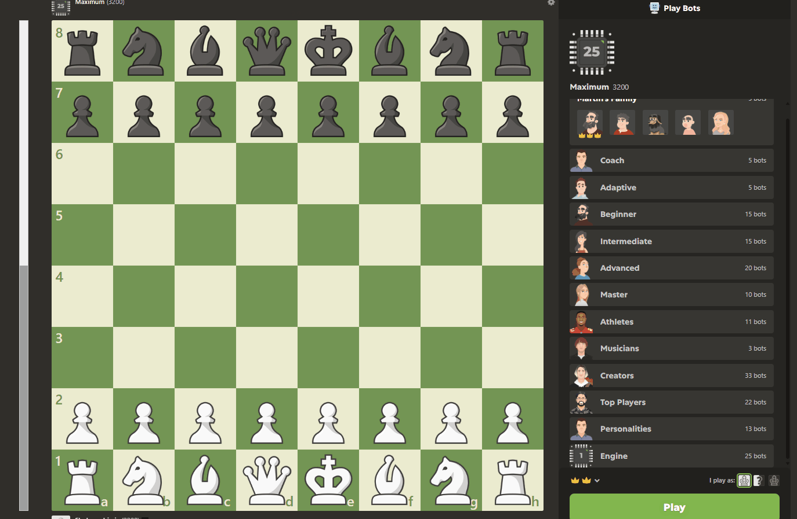

# Chess AI for Chess.com ♟️🤖

A powerful browser extension that enhances Chess.com with integrated Stockfish analysis, providing professional-level move suggestions, evaluation, and automated play options.  🚀

 <!-- Please replace with an actual demo GIF -->

## Features ✨

- **Advanced Move Analysis**: Integrated Stockfish engine evaluates positions in real-time ⚡️
- **Visual Move Indicators**: Shows best moves with highlights or arrows on the board 🎯
- **Adjustable Engine Strength**: Set ELO ratings from 1000-3000 to match your skill level 🏆
- **Dynamic Evaluation Bar**: Visual representation of position advantage with customizable colors 📊
- **Move History Tracking**: Keeps record of analyzed moves with evaluation and depth 📜
- **Human Mode**: Makes the engine play more like a human with realistic timing and occasional mistakes 🧑‍🦱
- **Fusion Mode**: Automatically matches your opponent's rating for balanced play ⚖️
- **Auto Run & Auto Move**: Optionally automates analysis and move execution 🤖
- **Full Keyboard Control**: Quick access to all depths with keyboard shortcuts ⌨️
- **Comprehensive Settings**: Fully customizable interface and behavior ⚙️

## Installation 📥

1. Install a userscript manager:
   - [Tampermonkey](https://www.tampermonkey.net/) (Chrome, Firefox, Edge, Safari) 🐒
   - [Violentmonkey](https://violentmonkey.github.io/) (Chrome, Firefox) 🙈

2. Install Chess AI by clicking [here](https://github.com/longkidkoolstar/Chess-AI/raw/main/Chess-AI.user.js)

3. Visit [Chess.com](https://www.chess.com/play) and the tool will automatically activate 🎉

## Usage Guide 📖

### Quick Start
1. Go to Chess.com and start or join a game
2. Press a letter key (Q-M) to analyze at different depths
3. The best move will be highlighted on the board
4. Use the evaluation bar on the left to see who has the advantage

### Detailed Controls

#### Engine Depth
- **Keys Q-Z**: Run engine analysis at depths 1-26
  - Q = depth 1 (fastest, weakest) 💨
  - Z = depth 20 (slower, stronger) 🐢
  - = (equals) = maximum depth ♾️

#### Settings Panel
The settings panel provides access to all features and is organized into tabs:

- **Engine**: Set depth and ELO rating
- **Actions**: Run/stop engine, save settings
- **Visual**: Customize evaluation bar colors and move indicators
- **Play Style**: Configure Human Mode and Fusion Mode
- **Auto**: Set up automatic analysis and moves

#### Human Mode
Makes the engine play with human-like characteristics:
- Adjustable skill levels from Beginner (~800 ELO) to Expert (~2400 ELO)
- Introduces realistic thinking time 🤔
- Occasionally plays suboptimal moves 😕
- Rarely makes blunders like a human would 🤯

#### Fusion Mode
When enabled, automatically adjusts engine strength to match your opponent's rating, creating a fair and balanced experience.

## Keyboard Shortcuts ⌨️

| Key | Function | Strength Level |
|-----|----------|----------------|
| Q-E | Depths 1-3 | Beginner |
| R-P | Depths 4-10 | Intermediate |
| A-G | Depths 11-15 | Advanced |
| H-L | Depths 16-19 | Expert |
| Z-M | Depths 20-26 | Master |
| = | Maximum depth | Grandmaster |

## Tips & Tricks 👍

- For casual analysis, depths 5-10 offer a good balance of speed and accuracy
- For critical positions, use depths 15+ for deeper analysis
- Enable persistent highlights to keep move suggestions visible
- Use Human Mode during practice to get more realistic opponent behavior
- Save your preferred settings for future sessions

## Disclaimer ⚠️

This tool is intended for analysis, learning, and casual play. Using automated tools in rated games may violate Chess.com's terms of service. Use responsibly and at your own risk.

## Credits 🙌

- Created by [longkidkoolstar](https://github.com/longkidkoolstar)
- Built with [Stockfish](https://stockfishchess.org/), the world's strongest open-source chess engine

## License 📜

This project is for personal use only and not for redistribution.